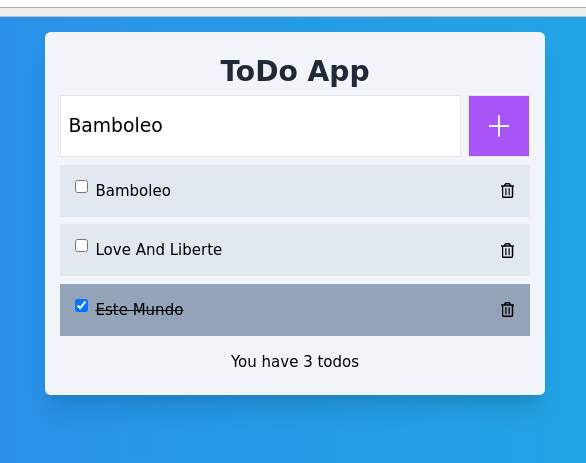

# Tasks and Reminders Application #

Application which help the user to manage tasks and reminders

## Concept ##
- Categorize tasks and reminders 
- Add a new Task / Reminder
- Update status (finished / ongoing)
- Delete permanently a task / reminder

## Version 1 specs ##

### Technical Stack ###
* Data storage: Firebase 9 
* FrontEnd: React JS, Tailwind 
* BackEnd: Serverless
* Built using: Vite
* Architecture: To be defined 

### Available Functions ###
* Add a new task
* Display tasks
* Update status
* Delete a Task

## Branches ##
* OldStable : deprecated versions of the project
* Stable: current or latest official version
* Unstable: sourcecode that is in progress of testing
* Experimental: sourcecode in progress

## Snapshots ##

## Proof of Concept ##
[Todo]

## Bugs ##
Please refer to the Issues section in this repository

## References ###
[Original tutorial](https://youtu.be/drF8HbnW87w?si=MD15WKGIJXGMdCEq)
