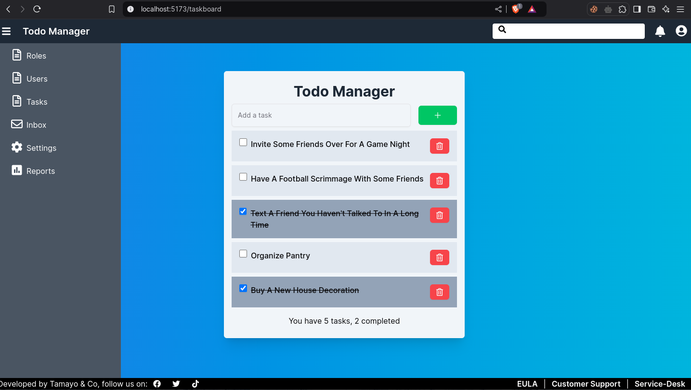
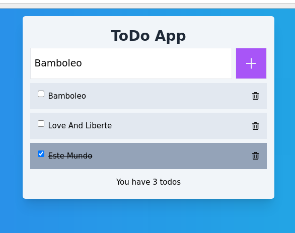

# 1. Overview

Frontend for API for managing tasks assigned to users.

---

### UI version 2:

### UI version 1:

# 2. Level of complexity

==BEGINNER==: this version is properly for developer technical skills in the use of the technical stack, it is the foundational part for building projects of more complexity.

---

# 3. Major Releases Timeline

## 0.2.0

- Released on September 2025
- Unit tested
- Spec coverage of 55%

## 0.1.5

- Special features such as rate limiting

---

# 4. Architectural Diagram

## Technology Stack

| **Aspect**               | **Implementation**                               |
| ------------------------ | ------------------------------------------------ |
| **Architecture Pattern** | **Container-Presenter (Smart/Dumb Components)**  |
| **State Management**     | React Query + Local React State                  |
| **API Pattern**          | RESTful with pagination support                  |
| **Error Handling**       | Global error boundary + contextual notifications |
| **UI Pattern**           | Component composition with memoization           |
| **Data Fetching**        | React Query with customized hooks                |

## Design Patterns

| **Pattern**             | **Implementation Details**                                       |
| ----------------------- | ---------------------------------------------------------------- |
| **Container-Presenter** | TaskBoardContainer (logic) + TaskBoardPresenter (UI)             |
| **Custom Hooks**        | Domain-specific hooks for tasks (useTaskBoard, useTaskMutations) |
| **Composition**         | Features composed from smaller, reusable components              |
| **Adapter**             | API client abstracts backend communication details               |
| **Strategy**            | Different strategies for handling mutations vs. queries          |
| **Observer**            | React Query for observing and reacting to data changes           |

### Other pattern implemented

- Service Layer
- Context pattern
- Compound component pattern
- High Order component pattern (Auth Guard)
- Factory Pattern (Button and Card)

## Complete System Architecture

```mermaid
graph TB
    %% Root Application Layer
    subgraph "🚀 Application Root"
        App[App.tsx]
        AppContent[AppContent]
        App --> Provider[Redux Provider]
        App --> QueryProvider[React Query Provider]
        App --> AuthProvider[Auth Provider]
        App --> Router[Wouter Router]
        App --> Toaster[Sonner Toaster]
        App --> GlobalModal[Global Modal Container]
        Router --> CustomOutlet[Custom Outlet]
    end

    %% Routing Layer
    subgraph "🛣️ Routing Layer"
        CustomOutlet --> LandingRoute["/landing"]
        CustomOutlet --> DashboardRoute["/dashboard"]
        CustomOutlet --> TaskBoardRoute["/dashboard/tasks"]

        LandingRoute --> LandingContainer
        DashboardRoute --> AuthGuard1[Auth Guard]
        TaskBoardRoute --> AuthGuard2[Auth Guard]

        AuthGuard1 --> MainLayout1[Main Layout]
        AuthGuard2 --> MainLayout2[Main Layout]

        MainLayout1 --> DashBoardContainer
        MainLayout2 --> TaskBoardContainer
    end

    %% Container Layer (Business Logic)
    subgraph "📦 Container Layer"
        LandingContainer[Landing Container]
        DashBoardContainer[Dashboard Container]
        TaskBoardContainer[TaskBoard Container]
        SettingsContainer[Settings Container]

        LandingContainer --> LandingPresenter
        DashBoardContainer --> DashBoardAnalyticsPresenter
        TaskBoardContainer --> TaskBoardPresenter
        SettingsContainer --> SettingsPresenter
    end

    %% Presenter Layer (UI Components)
    subgraph "🎨 Presenter Layer"
        LandingPresenter[Landing Presenter]
        DashBoardAnalyticsPresenter[Dashboard Analytics Presenter]
        TaskBoardPresenter[TaskBoard Presenter]
        SettingsPresenter[Settings Presenter]

        LandingPresenter --> HeaderContainer
        LandingPresenter --> ContentContainer
        LandingPresenter --> FooterContainer

        TaskBoardPresenter --> AddTaskForm
        TaskBoardPresenter --> TaskList
        TaskBoardPresenter --> OffsetPagination
        TaskBoardPresenter --> TaskBoardStats
    end

    %% Feature-Based Components
    subgraph "🧩 Feature Components"
        subgraph "Auth Features"
            LoginCard[Login Card]
            SignUpCard[SignUp Card]
            LogoutConfirmation[Logout Confirmation]
            ProfileCard[Profile Card]
        end

        subgraph "Task Features"
            AddTaskForm[Add Task Form]
            UpdateTaskCard[Update Task Card]
            TaskList[Task List]
            TaskBoardStats[Task Board Stats]
        end

        subgraph "Dashboard Features"
            DashBoardHeader[Dashboard Header]
            DashBoardToggleMenuBar[Dashboard Menu]
            DashBoardFooter[Dashboard Footer]
            ContainerHeader[Container Header]
            ProfileMenu[Profile Menu]
        end

        subgraph "Settings Features"
            LanguageComponent[Language Component]
            ThemeComponent[Theme Component]
            TimeZoneComponent[TimeZone Component]
            FontSizeComponent[FontSize Component]
        end
    end

    %% Custom Hooks Layer
    subgraph "🎣 Custom Hooks Layer"
        subgraph "Auth Hooks"
            useAuthState[useAuthState]
            useAuthMutations[useAuthMutations]
            AuthContext[Auth Context]
        end

        subgraph "Task Hooks"
            useTaskBoard[useTaskBoard]
            useTaskQueries[useTaskQueries]
            useTaskMutations[useTaskMutations]
            useTaskDataFetcher[useTaskDataFetcher]
            useTaskStatsCalculator[useTaskStatsCalculator]
        end

        subgraph "UI Hooks"
            useModalState[useModalState]
            usePaginationState[usePaginationState]
            useSettingsForm[useSettingsForm]
            useHealthCheck[useHealthCheck]
        end

        subgraph "Redux Hooks"
            useAppSelector[useAppSelector]
            useAppDispatch[useAppDispatch]
            useTranslation[useTranslation]
        end
    end

    %% State Management Layer
    subgraph "🗄️ State Management"
        subgraph "Redux Store"
            Store[Redux Store]
            Store --> TaskSlice[Task UI Slice]
            Store --> SettingsSlice[Settings Slice]
            Store --> HealthSlice[Health Metrics Slice]
            Store --> MenuSlice[Menu Slice]
            Store --> ModalSlice[Modal Slice]
        end

        subgraph "React Query"
            QueryClient[Query Client]
            QueryClient --> TaskQueries[Task Queries]
            QueryClient --> AuthQueries[Auth Queries]
            QueryClient --> HealthQueries[Health Queries]
        end

        subgraph "Auth Context"
            AuthProvider --> AuthState[Auth State]
            AuthState --> AuthMethods[Auth Methods]
        end
    end

    %% API Layer
    subgraph "🌐 API Layer"
        subgraph "API Client"
            ApiClient[API Client]
            ApiClient --> AuthOps[Auth Operations]
            ApiClient --> UserOps[User Operations]
            ApiClient --> TaskOps[Task Operations]
            ApiClient --> BeOps[Backend Operations]
        end

        subgraph "API Helpers"
            ApiHelpers[API Helpers]
            ApiHelpers --> RequestHandler[Request Handler]
            ApiHelpers --> ErrorHandler[Error Handler]
            ApiHelpers --> CacheManager[Cache Manager]
            ApiHelpers --> RateLimitHandler[Rate Limit Handler]
        end
    end

    %% Services Layer
    subgraph "⚙️ Services Layer"
        NotificationService[Notification Service]
        HealthService[Health Service]
        SettingsService[Settings Service]
        ThemeService[Theme Service]
        LanguageService[Language Service]
    end

    %% Backend API Endpoints
    subgraph "🔗 Backend API Endpoints"
        subgraph "Authentication"
            LoginEndpoint["/users/login"]
            SignupEndpoint["/users/register"]
            LogoutEndpoint["/users/logout"]
            MeEndpoint["/users/me"]
        end

        subgraph "Tasks"
            GetTasksEndpoint["/todos/list/page"]
            GetTaskEndpoint["/todos/task/:id"]
            CreateTaskEndpoint["/todos/create"]
            UpdateTaskEndpoint["/todos/update/:id"]
            DeleteTaskEndpoint["/todos/delete/:id"]
            ToggleTaskEndpoint["/todos/task/:id/done"]
        end

        subgraph "Health Check"
            AppHealthEndpoint["/healthcheck/app"]
            DbHealthEndpoint["/healthcheck/db"]
        end
    end

    %% Data Flow Connections
    TaskBoardContainer -.->|uses| useTaskBoard
    useTaskBoard -.->|fetches data| useTaskQueries
    useTaskQueries -.->|calls| TaskOps
    TaskOps -.->|HTTP requests| GetTasksEndpoint

    LoginCard -.->|submits| useAuthMutations
    useAuthMutations -.->|calls| AuthOps
    AuthOps -.->|HTTP requests| LoginEndpoint

    GlobalModal -.->|manages| useModalState
    useModalState -.->|updates| ModalSlice

    DashBoardContainer -.->|uses| useHealthCheck
    useHealthCheck -.->|calls| BeOps
    BeOps -.->|HTTP requests| AppHealthEndpoint

    SettingsContainer -.->|uses| useSettingsForm
    useSettingsForm -.->|updates| SettingsSlice

    %% Modal System Connections
    GlobalModal --> LoginCard
    GlobalModal --> SignUpCard
    GlobalModal --> LogoutConfirmation
    GlobalModal --> UpdateTaskCard
    GlobalModal --> SettingsContainer

    %% Layout Connections
    MainLayout1 --> DashBoardHeader
    MainLayout1 --> DashBoardToggleMenuBar
    MainLayout1 --> DashBoardFooter

    DashBoardHeader --> ContainerHeader
    ContainerHeader --> ProfileMenu

    %% Error Handling & Notifications
    ApiHelpers -.->|shows errors| NotificationService
    useTaskBoard -.->|handles errors| NotificationService
    useAuthMutations -.->|shows success/error| NotificationService

    %% Styling
    classDef container fill:#e1f5fe
    classDef presenter fill:#f3e5f5
    classDef hook fill:#e8f5e8
    classDef api fill:#fff3e0
    classDef store fill:#fce4ec
    classDef service fill:#f1f8e9
    classDef endpoint fill:#ffebee

    class LandingContainer,DashBoardContainer,TaskBoardContainer,SettingsContainer container
    class LandingPresenter,DashBoardAnalyticsPresenter,TaskBoardPresenter,SettingsPresenter presenter
    class useAuthState,useTaskBoard,useModalState,usePaginationState hook
    class ApiClient,AuthOps,TaskOps,BeOps,UserOps api
    class Store,TaskSlice,SettingsSlice,ModalSlice store
    class NotificationService,HealthService,SettingsService service
    class LoginEndpoint,GetTasksEndpoint,AppHealthEndpoint endpoint

```

## Technical Features

| **Feature**                 | **Implementation**                                  |
| --------------------------- | --------------------------------------------------- |
| **Pagination**              | Offset-based with prefetching of adjacent pages     |
| **Caching**                 | Multi-level: React Query + Client-side memory cache |
| **Cache Invalidation**      | Post-mutation with controlled refetching            |
| **Rate Limiting**           | Graceful handling with fallback to cached data      |
| **Race Condition Handling** | Delayed operations with cache busting               |
| **Optimistic Updates**      | Planned but postponed for stability first           |
| **Error Management**        | Contextual error handling with user notifications   |

## Performance Optimizations

| **Optimization**          | **Implementation**                                |
| ------------------------- | ------------------------------------------------- |
| **Memoization**           | useMemo for task lists and expensive calculations |
| **Debouncing**            | Prefetch requests debounced to reduce API calls   |
| **Conditional Fetching**  | Only fetch data not already in cache              |
| **Cache TTL**             | 60-second client-side cache to reduce requests    |
| **Request Deduplication** | React Query automatic request deduplication       |

## Data Flow

| **Operation**     | **Implementation**                                               |
| ----------------- | ---------------------------------------------------------------- |
| **Read**          | React Query hooks → API client → Backend                         |
| **Create**        | Form submission → Mutation hook → Cache invalidation → Refetch   |
| **Update**        | Modal form → Mutation hook → Cache invalidation → Refetch        |
| **Delete**        | Row action → Mutation hook → Cache invalidation → Refetch        |
| **Toggle Status** | Row action → Specialized mutation → Cache invalidation → Refetch |

## Key Components

| **Component**          | **Responsibility**                |
| ---------------------- | --------------------------------- |
| **TaskBoardContainer** | Orchestration and data management |
| **TaskBoardPresenter** | UI rendering and composition      |
| **TaskRowContainer**   | Individual task item management   |
| **AddTaskForm**        | Task creation with validation     |
| **UpdateTaskCard**     | Task editing with validation      |
| **OffsetPagination**   | Page navigation UI and logic      |

## Custom Hooks

| **Hook**               | **Responsibility**                     |
| ---------------------- | -------------------------------------- |
| **useTaskBoard**       | Main data fetching for tasks           |
| **useTaskMutations**   | CRUD operations with cache management  |
| **useTaskPagination**  | Page management with smart prefetching |
| **useTaskPrefetching** | Adjacent page prefetching logic        |

## Future Improvements

| **Area**             | **Potential Improvement**                                          |
| -------------------- | ------------------------------------------------------------------ |
| **Architecture**     | **Migrate to feature-based module system with clear boundaries**   |
| **Architecture**     | **Implement Command pattern for mutations to improve testability** |
| **Architecture**     | **Add Repository pattern layer between API and hooks**             |
| **Architecture**     | **Implement proper Domain-Driven Design with aggregate roots**     |
| **Performance**      | Implement virtualized lists for handling large datasets            |
| **State Management** | Consider zustand/jotai for global UI state                         |
| **API Design**       | Implement GraphQL for more efficient data fetching                 |
| **Offline Support**  | Add service workers and offline capabilities                       |
| **Optimistic UI**    | Implement optimistic updates after core stability                  |
| **Microservices**    | Prepare architecture for microservices frontend (micro-frontends)  |
| **Testing**          | Implement comprehensive test coverage with MSW for API mocking     |
|                      | GraphQL integration pending                                        |
|                      | Real-time features not implemented                                 |
|                      | Testing coverage needs improvement                                 |
|                      | Offline support missing                                            |

---

# 10. Branches

1. ==Main==: it contains the latest deployed and published codebase, this one has been tested against unit, integration and end 2 end, also, there are special directories related to developer such as: devops (CI/CD pipelines), sshots (images for README file) and developer (diagrams, postman yaml files, documentation)

2. ==Stage==: target branch for test the execution of the CI/CD pipelines, includes the interaction with the CI tools and cloud providers, the use of this branch is suggested for QA and DevOps teams. Pre-release version management, this one should be the only one merged with main branch.

3. ==Unstable==: it containts the test codebase (unit, integration, end 2 end), it interacts with experimental and stage branches, must not merge with main.

4. ==Experimental==: alpha version of the codebase, all features are built here, it interacts with unstable and stage, must not be merged directly with main branch.

5. ==Refactor==: special feature requires by Experimental branch, the intention is to not affect the latest run version of the codebase contained in Experimental, if must be merged just with experimental branch.
